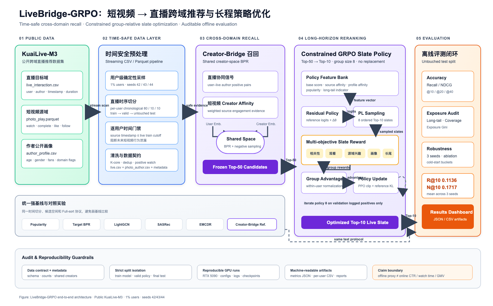

# LiveBridge-GenRec

[](https://github.com/candy-zy/livebridge-generative-recsys/actions/workflows/ci.yml)
[](LICENSE)

**Short-video-to-live cross-domain recommendation with generative retrieval and constrained slate-level RL.**

面向直播推荐中的用户行为稀疏、主播冷启动和热门内容挤压长尾曝光问题，本项目基于公开 [KuaiLive-M3](https://imgkkk574.github.io/KuaiLive-M3/) 搭建短视频到直播的跨域推荐系统，覆盖：

- 共享 Creator 表征的跨域召回；
- 跨模态内容对齐与 Semantic-ID 生成式召回；
- 面向准确率与内容生态的受约束 GRPO 列表重排；
- 时间安全数据门禁、Full-sort 评测、消融实验与结果 Dashboard。

> 本仓库公开代码、配置、聚合指标与实验报告，不重新分发数据集、模型权重、逐用户结果或预计算内容向量。

## Architecture



生成式召回分支：[`docs/generative_retrieval_architecture.svg`](docs/generative_retrieval_architecture.svg)。

## Highlights

### 1. Creator-Bridge cross-domain retrieval

将用户在短视频域的作者兴趣迁移到直播作者候选空间，并使用逐用户直播训练截止时间过滤源域事件，避免未来行为泄漏。在时间安全的 1% 用户协议、三个随机种子下：

| Model | Recall@10 | NDCG@10 |
|---|---:|---:|
| LightGCN | 0.0391 ± 0.0125 | 0.0611 ± 0.0036 |
| **Creator-Bridge** | **0.1023 ± 0.0168** | **0.1640 ± 0.0081** |

详细对照与 SASRec 调参记录见 [`reports/STRONG_BASELINES.md`](reports/STRONG_BASELINES.md)，聚合原始结果见 [`results/strong_baselines/three_seed_summary.json`](results/strong_baselines/three_seed_summary.json)。

### 2. Semantic-ID generative retrieval

1. 对 KuaiLive-M3 提供的短视频 128D 与直播 64D 内容向量进行作者级 InfoNCE 对齐；
2. 对行为表征执行 Residual K-Means，构造分层 Semantic ID；
3. 使用因果 Transformer 自回归生成下一位直播作者的 Semantic ID；
4. 缓存 Top-200 生成候选，并以 validation-selected 内容相似度做 late fusion。

全量 seed42 使用 7,870,064 条交互、600,935 个候选作者和 21,825 个测试用户：

| Model | Recall@40 | NDCG@40 |
|---|---:|---:|
| ID-only generator | 0.03587 | 0.04377 |
| **Content late fusion** | **0.04300** | **0.05231** |
| Relative gain | **+19.9%** | **+19.5%** |

1% 三随机种子的 paired bootstrap 95% CI 均不跨 0；10% 与全量实验仅运行 seed42，因此不声称全量统计显著或公开榜单 SOTA。完整失败消融与修复见 [`reports/GENERATIVE_RETRIEVAL_RESULTS.md`](reports/GENERATIVE_RETRIEVAL_RESULTS.md)。

### 3. Constrained GRPO slate reranking

将 Top-10 推荐列表作为整体决策，在 Top-50 候选中采样同一用户的多组不放回轨迹，并使用组内标准化 advantage、PPO Clip 和 Reference KL 联合优化 logged relevance、跨域兴趣及长尾曝光。

| System | Recall@10 | NDCG@10 | Long-tail Share@10 |
|---|---:|---:|---:|
| Creator-Bridge | 0.1023 ± 0.0168 | 0.1640 ± 0.0081 | 0.3093 ± 0.0148 |
| **Creator-Bridge + GRPO** | **0.1136 ± 0.0182** | **0.1717 ± 0.0095** | **0.5411 ± 0.0148** |

三个种子主指标均同向提升；奖励消融显示长尾收益伴随明确的准确率—曝光权衡。详见 [`reports/GRPO_RESULTS.md`](reports/GRPO_RESULTS.md) 与 [`results/grpo/three_seed_summary.json`](results/grpo/three_seed_summary.json)。

## Reproducibility

要求 Python 3.10+。

```bash
git clone https://github.com/candy-zy/livebridge-generative-recsys.git
cd livebridge-generative-recsys
python -m venv .venv
source .venv/bin/activate
pip install -e '.[dev]'
pytest -q
```

下载 KuaiLive-M3 后先验证数据契约：

```bash
livebridge validate-data --data-dir /path/to/KuaiLive-M3
```

时间安全预处理与 Creator-Bridge：

```bash
livebridge prepare \
  --data-dir /path/to/KuaiLive-M3 \
  --output-dir data/processed/klm3_temporal_1pct_seed42 \
  --sample-ratio 0.01 --seed 42 --source-mode temporal

livebridge train \
  --processed-dir data/processed/klm3_temporal_1pct_seed42 \
  --output-dir runs/bridge_seed42 \
  --mode bridge --epochs 30 --seed 42
```

GRPO 与生成式召回的完整入口分别见：

- [`scripts/run_grpo_suite.sh`](scripts/run_grpo_suite.sh)
- [`scripts/run_generative_stage1.sh`](scripts/run_generative_stage1.sh)
- [`scripts/run_generative_full_seed42.sh`](scripts/run_generative_full_seed42.sh)

## Repository layout

```text
├── src/livebridge_rl/
│   ├── preprocess.py             # time-safe preprocessing
│   ├── baseline.py               # Target-BPR / Creator-Bridge
│   ├── strong_baselines.py       # LightGCN / SASRec / EMCDR
│   ├── generative_retrieval.py   # alignment, Semantic ID, generator
│   └── grpo_reranker.py          # constrained slate-level GRPO
├── scripts/                      # experiment launchers and summaries
├── tests/                        # unit and pipeline tests
├── results/                      # small, auditable aggregate artifacts
├── reports/                      # experiment reports and limitations
├── docs/                         # data contract and architecture diagrams
└── dashboard/                    # local result dashboard
```

## Evaluation boundaries

- 所有指标均为公开数据上的离线 Recall/NDCG 或代理奖励，不代表线上 CTR、观看时长、GMV 或收入提升；
- GRPO 使用 validation logged positives 训练，test split 不参与模型或策略训练；
- 项目不具备 propensity logging，因此不声称无偏反事实 OPE；
- 内容编码使用数据集提供的预计算向量，不声称训练了原始视频 MLLM；
- Session Router 是保留失败证据的离线研究分支，不作为完整交互式 Agentic RL 结论。

## Data and license

- Dataset: [KuaiLive-M3 project page](https://imgkkk574.github.io/KuaiLive-M3/)
- Download: [Hugging Face dataset card](https://huggingface.co/datasets/imgkkk2004/KuaiLive-M3)
- Official benchmark: [imgkkk574/KuaiLive-M3](https://github.com/imgkkk574/KuaiLive-M3)

代码以 [Apache-2.0](LICENSE) 发布。数据集及其预计算特征遵循原数据发布方的许可，本仓库不重新分发相关文件。
